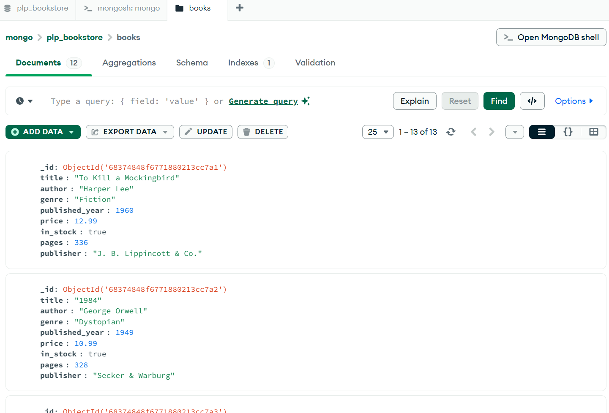
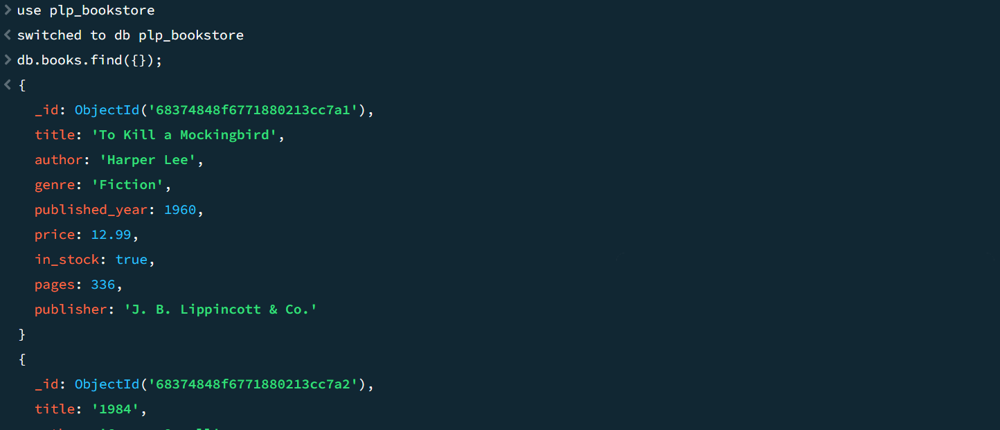
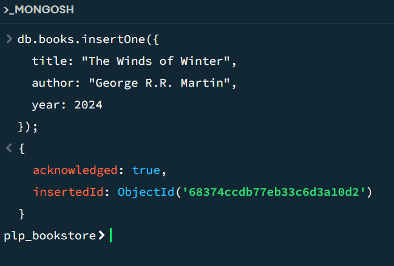

# MongoDB Fundamentals Assignment – Francis Auka

## Overview

This assignment demonstrates my understanding of MongoDB fundamentals including:

- MongoDB setup and connection
- Basic CRUD operations
- Advanced queries (filtering, projection, sorting)
- Aggregation pipelines
- Indexing for performance optimization

## Setup Instructions

### Tools Used

- **MongoDB Compass** – for GUI-based interaction with MongoDB
- **Node.js v18+** – for running the `insert_books.js` script
- **MongoDB Atlas** – (optional, local setup used in this project)

### Prerequisites

1. Install Node.js: [https://nodejs.org](https://nodejs.org)
2. Install MongoDB locally: [https://www.mongodb.com/try/download/community](https://www.mongodb.com/try/download/community)
3. Install MongoDB Compass: [https://www.mongodb.com/products/compass](https://www.mongodb.com/products/compass)

### Cloning the Repository

```bash
git clone https://github.com/YOUR-USERNAME/week-1-mongodb-fundamentals-assignment-francis-auka.git
cd week-1-mongodb-fundamentals-assignment-francis-auka
```

### Install Dependencies and Run Script

Install the MongoDB Node.js driver:

```bash
npm install mongodb
```

Start your MongoDB server (if local).

Run the data population script:

```bash
node insert_books.js
```

You should see a list of inserted books in the terminal.

### screenshots










